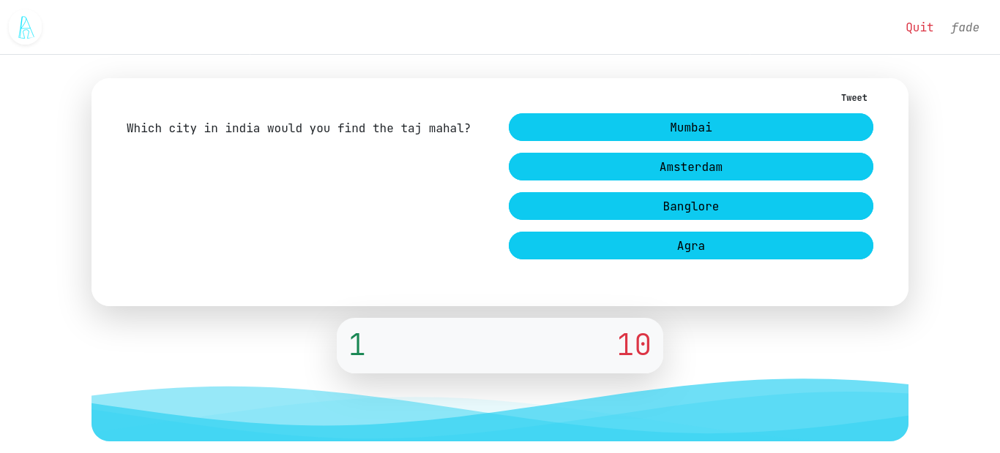

# Quix

Quiz is a trivia quiz [website](https://quiix.herokuapp.com) built with python flask framework. 

## Techonologies

<!--  -->

# Contribute
It OK, you can always add questions to the database, it counts! 

visit [quiix.herokuapp.com/contribute](https://quiix.herokuapp.com/contribute) for more info
